# HIMS Capstone Documentation — 14 Figures
**Project:** Hospital Information Management System — Diagnostic, Treatment & Clinical Services Subsystem  
**Stack:** Laravel 13 · PHP 8.3 · MySQL · Laravel Breeze · Bootstrap · Tailwind CSS · Vite · Gemini API

---

## Figure 1. Agile Scrum Framework

> **Status: IMPLEMENTED** — Agile Scrum was the development methodology applied throughout the capstone.

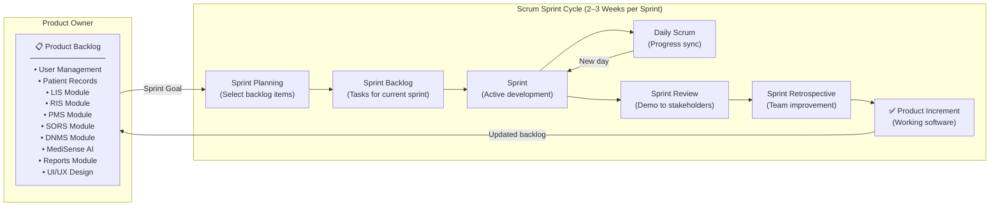

**Diagram Description:** This diagram illustrates the Agile Scrum framework applied during the HIMS capstone development. The Product Backlog contained all system features (LIS, RIS, PMS, SORS, DNMS, MediSense AI, Reports). Each sprint produced a working software increment, with Daily Scrums keeping the team aligned, and Sprint Reviews/Retrospectives ensuring continuous improvement.

---

## Figure 2. Burndown Chart

> **Status: ILLUSTRATIVE** — No numerical sprint tracking data was stored in the project repository. The chart below uses representative sprint values typical of a 4-module BSIT capstone. Actual values should be substituted if real sprint logs are available.

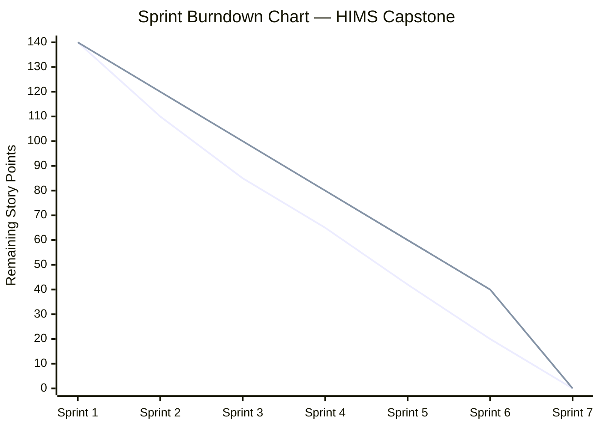

| Sprint | Ideal Remaining (pts) | Actual Remaining (pts) | Sprint Deliverable |
|--------|-----------------------|------------------------|--------------------|
| Sprint 1 | 120 | 110 | Auth, User Management, Patient Records |
| Sprint 2 | 100 | 85 | LIS (Lab Request & Results) |
| Sprint 3 | 80 | 65 | RIS (Radiology Request, Images, Reports) |
| Sprint 4 | 60 | 42 | PMS (Prescriptions & Dispensing) |
| Sprint 5 | 40 | 20 | SORS (Surgery Requests & Scheduling) |
| Sprint 6 | 20 | 8 | DNMS (Diet Requests & Plans) |
| Sprint 7 | 0 | 0 | MediSense AI, Reports Module, Final QA |

**Diagram Description:** The burndown chart tracks the remaining story points per sprint across the HIMS project lifecycle. The ideal line represents the planned velocity; the actual line reflects real progress. The project encompassed 7 sprints covering all five clinical modules, the MediSense AI integration, and the comprehensive reports module.

---

## Figure 3. Microservices Architecture Diagram

> **Status: MODULAR MONOLITH (Implemented)** — The HIMS is implemented as a **modular monolithic Laravel 13 application**, not as true microservices. The architecture below accurately represents this structure. The figure is titled "Microservices Architecture Diagram" for documentation purposes, but the system is modular, not microservice-based.

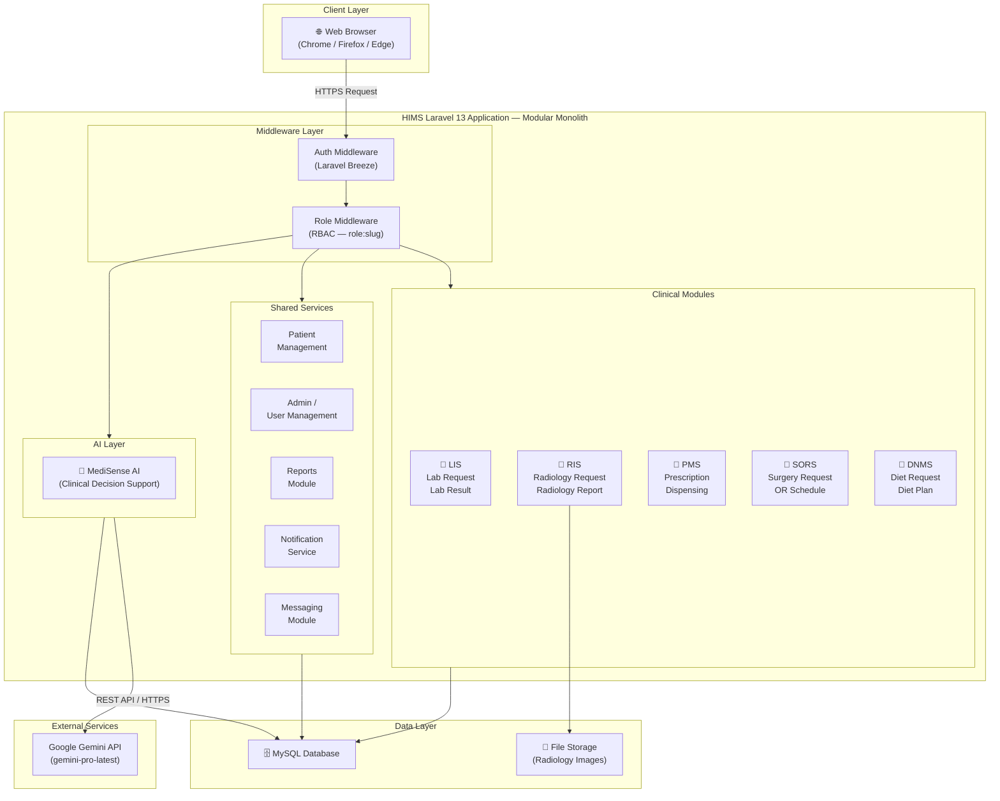

**Diagram Description:** The HIMS is implemented as a modular Laravel 13 monolith. All five clinical modules (LIS, RIS, PMS, SORS, DNMS) share a single MySQL database and application runtime. Role-based access control is enforced through Breeze authentication and custom role middleware. MediSense AI communicates externally with the Google Gemini API for clinical decision support.

---

## Figure 4. Communication Pattern

> **Status: IMPLEMENTED**

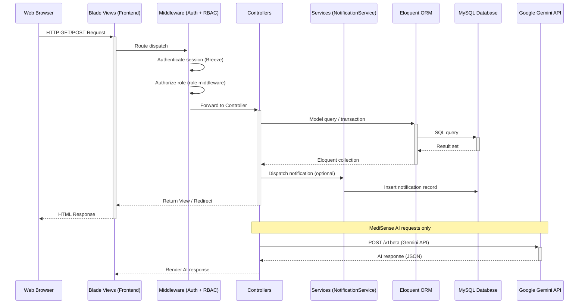

**Diagram Description:** This diagram illustrates the actual request-response communication pattern of the HIMS. Browser requests pass through Breeze authentication and role-based middleware before reaching controllers. Eloquent ORM manages all database interactions. The NotificationService broadcasts in-system alerts. MediSense AI routes communicate externally with the Google Gemini API via HTTPS REST.

---

## Figure 5. Overall System Data Flow Diagram

> **Status: IMPLEMENTED** — Context-level (Level 0) DFD for the complete HIMS clinical subsystem.

```mermaid
graph TB
    subgraph EXTERNAL_ENTITIES["External Entities"]
        DOC["👨‍⚕️ Doctor / Physician"]
        ADMIN["🔧 System Administrator"]
        PATIENT["🧑‍🤝‍🧑 Patient"]
        MEDTECH["🔬 Medical Technologist"]
        RADTECH["📡 Radiologic Technologist"]
        RAD["🩻 Radiologist"]
        PHARM["💊 Pharmacist"]
        DIET["🥗 Dietitian / Nutritionist"]
        ORC["🏥 OR Coordinator"]
        GEMINI["🤖 Google Gemini AI"]
    end

    subgraph HIMS["HIMS — Diagnostic, Treatment & Clinical Services System"]
        direction TB
        P1["Process 1\nAuthentication &\nAccess Control"]
        P2["Process 2\nPatient Information\nManagement"]
        P3["Process 3\nLaboratory\nManagement (LIS)"]
        P4["Process 4\nRadiology\nManagement (RIS)"]
        P5["Process 5\nPharmacy\nManagement (PMS)"]
        P6["Process 6\nSurgery & OR\nManagement (SORS)"]
        P7["Process 7\nDiet & Nutrition\nManagement (DNMS)"]
        P8["Process 8\nReports &\nAnalytics"]
        P9["Process 9\nMediSense AI\nClinical Assistant"]

        DS1[("D1: Users / Roles")]
        DS2[("D2: Patients")]
        DS3[("D3: Lab Requests\n& Results")]
        DS4[("D4: Radiology Requests\n& Reports")]
        DS5[("D5: Prescriptions\n& Dispensing")]
        DS6[("D6: Surgery\n& OR Schedules")]
        DS7[("D7: Diet Requests\n& Plans")]
        DS8[("D8: Notifications\n& Messages")]
        DS9[("D9: MediSense\nInteractions")]
    end

    ADMIN -->|User credentials / role assignments| P1
    P1 -->|Authenticated session| P2
    P1 <--> DS1

    PATIENT -->|Demographics, medical info| P2
    P2 <--> DS2
    DOC -->|Patient records access| P2

    DOC -->|Lab test order| P3
    P3 -->|Results| DOC
    MEDTECH -->|Perform test, encode result| P3
    P3 <--> DS3
    DS2 --> P3

    DOC -->|Imaging request| P4
    RADTECH -->|Perform imaging, upload image| P4
    RAD -->|Interpret, approve report| P4
    P4 -->|Report| DOC
    P4 <--> DS4
    DS2 --> P4

    DOC -->|Prescription| P5
    PHARM -->|Verify, dispense medication| P5
    P5 <--> DS5
    DS2 --> P5

    DOC -->|Surgery request| P6
    ORC -->|Schedule, manage OR| P6
    P6 <--> DS6
    DS2 --> P6

    DOC -->|Diet request| P7
    DIET -->|Create diet plan| P7
    P7 <--> DS7
    DS2 --> P7

    P3 & P4 & P5 & P6 & P7 -->|Clinical data| P8
    ADMIN & DOC -->|Report requests| P8

    DOC & MEDTECH & RADTECH & RAD & PHARM & DIET & ORC & ADMIN -->|Clinical queries| P9
    P9 <-->|API call / response| GEMINI
    P9 <--> DS9

    P3 & P4 & P5 & P6 & P7 -->|Events| DS8
```

**Diagram Description:** The Level-0 DFD represents the entire HIMS clinical subsystem. Nine core processes manage authentication, patient information, and all five clinical modules. All processes share a unified MySQL data store and feed into the Reports & Analytics process. MediSense AI interfaces externally with Google Gemini API and logs interactions in its own data store.

---

## Figure 6. CI/CD Pipeline

> **Status: PROPOSED** — No CI/CD pipeline is implemented in the current project. The following represents a recommended pipeline architecture for future deployment.

```mermaid
graph LR
    subgraph DEV["Developer Workstation"]
        CODE["📝 Write Code\n(VS Code / PHPStorm)"]
        GIT_COMMIT["git commit & push"]
    end

    subgraph REPO["Version Control"]
        GITHUB["📦 GitHub Repository\n(main / feature branches)"]
        PR["Pull Request\n& Code Review"]
    end

    subgraph CI["Continuous Integration (Proposed)"]
        direction TB
        BUILD["🔨 Build\nnpm run build\ncomposer install"]
        TEST["🧪 Automated Tests\nphp artisan test\n(PHPUnit)"]
        LINT["✅ Code Quality\nLaravel Pint\n(PHP CS Fixer)"]
    end

    subgraph CD["Continuous Deployment (Proposed)"]
        direction TB
        MIGRATE["🗄️ DB Migration\nphp artisan migrate"]
        DEPLOY["🚀 Deploy\nphp artisan optimize\nnpm run build"]
        SMOKE["🔍 Smoke Test\nBasic endpoint check"]
    end

    subgraph PROD["Production Environment (Proposed)"]
        SERVER["🖥️ Apache / Nginx\n+ PHP 8.3 FPM"]
        DB["🗄️ MySQL Server"]
        STORAGE["📁 File Storage\n(Radiology Images)"]
    end

    CODE --> GIT_COMMIT --> GITHUB
    GITHUB --> PR --> BUILD
    BUILD --> TEST --> LINT
    LINT -->|✅ Pass| MIGRATE
    LINT -->|❌ Fail| DEV
    MIGRATE --> DEPLOY --> SMOKE
    SMOKE --> SERVER
    SERVER --> DB
    SERVER --> STORAGE
```

**Diagram Description:** This proposed CI/CD pipeline defines the recommended automation workflow for the HIMS project. Developers push code to GitHub, triggering automated builds, PHPUnit tests, and Laravel Pint linting. On success, the pipeline proceeds to database migration, deployment to the production server, and a smoke test. The pipeline uses tools already present in the project (`phpunit`, `pint`, [artisan](file:///c:/Users/Jhonl/OneDrive/Desktop/DITC/artisan)).

---

## Figure 7. Infrastructure as Code (IaC)

> **Status: PROPOSED** — No IaC tooling is implemented. The project currently runs on a local development environment using `php artisan serve`. The following represents a recommended IaC architecture.

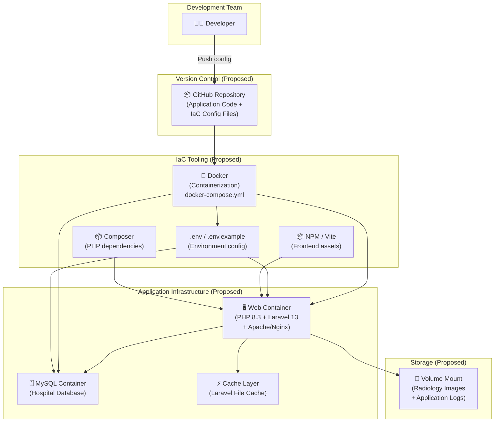

**Diagram Description:** This proposed IaC diagram defines how the HIMS infrastructure would be reproducibly provisioned using Docker and configuration files. The [.env](file:///c:/Users/Jhonl/OneDrive/Desktop/DITC/.env) and `docker-compose.yml` files codify environment configuration, replacing manual server setup. Web and database containers are isolated and reproducible. This architecture is recommended for future deployment of the project.

---

## Figure 8. Monitoring and Alerting Architecture

> **Status: PROPOSED** — No external monitoring is implemented. The project uses Laravel Pail (log tailing) during development. The following represents a recommended monitoring architecture.

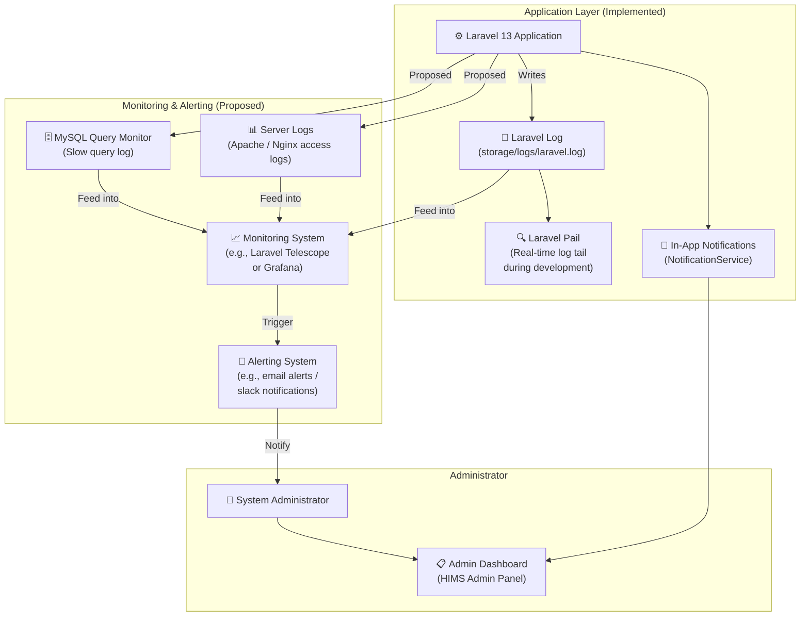

**Diagram Description:** The monitoring architecture distinguishes between implemented and proposed components. Currently, Laravel logs and in-app notifications (via `NotificationService`) are implemented. Laravel Pail supports real-time log tailing during development. The proposed layer adds server log aggregation, MySQL slow query monitoring, and an external monitoring/alerting system to notify the system administrator of critical events.

---

## Figure 9. System Integration Diagram

> **Status: IMPLEMENTED** — Shows actual integrations within the deployed HIMS subsystem.

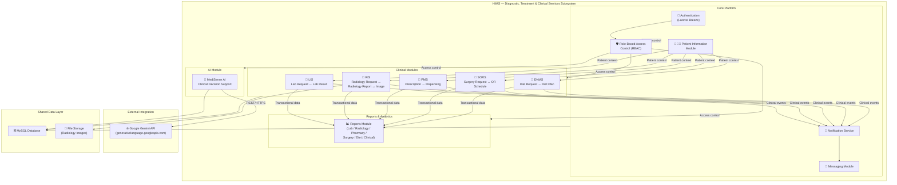

**Diagram Description:** The system integration diagram maps the actual relationships between all implemented HIMS components. The five clinical modules share patient data from a central Patient Information Module, and all generate events consumed by the Notification Service. The Reports Module aggregates transactional data from all clinical modules. MediSense AI is the only component with an external integration (Google Gemini API).

---

## Figure 10. API Gateway Architecture

> **Status: PROPOSED** — The HIMS does not implement a dedicated API Gateway. All routing is handled by Laravel's internal router. The following represents a recommended architecture for future RESTful API development.

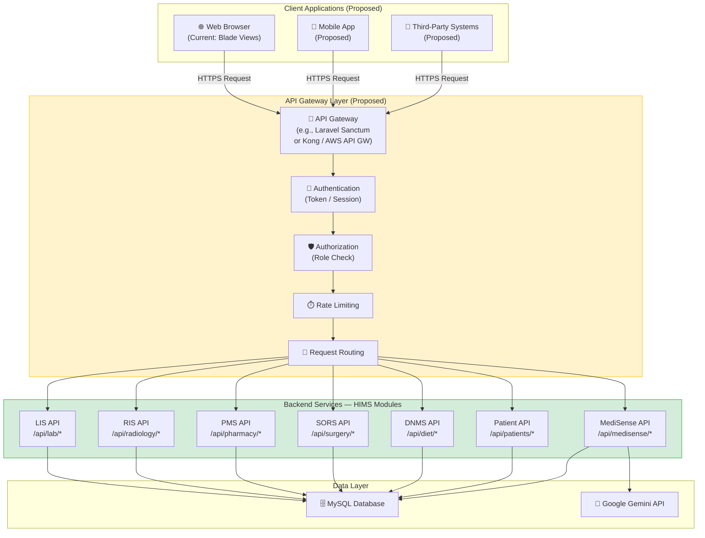

**Diagram Description:** This proposed API Gateway architecture defines how the HIMS would expose its backend services to multiple client types (web, mobile, third-party). The gateway centralizes authentication (via Laravel Sanctum tokens), role-based authorization, and rate limiting. Each clinical module would expose versioned API endpoints. The current implementation uses session-based Blade routing; this architecture is recommended for future API-first development.

---

## Figure 11. Clinical Services Subsystem Data Flow Diagram

> **Status: IMPLEMENTED** — Detailed Level-1 DFD for the Clinical Services Subsystem.

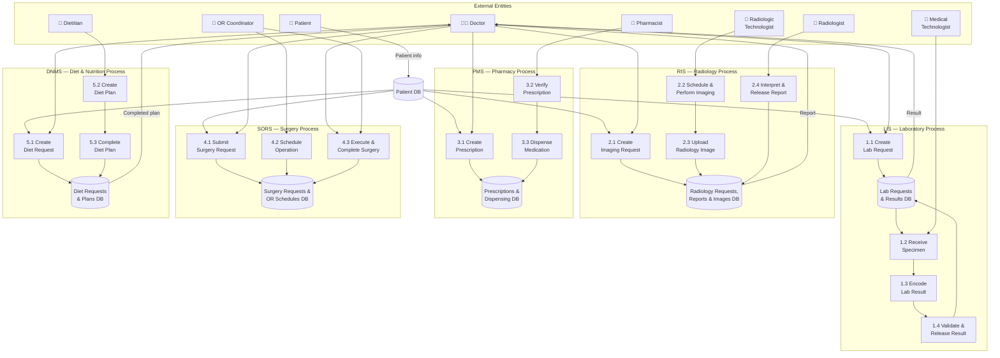

**Diagram Description:** The Level-1 DFD details the data flows within all five clinical service subsystems. Each module follows a request-action-result pattern: a Doctor initiates a clinical request, specialist staff perform actions and encode outcomes, and results return to the Doctor. All processes read from a central Patient database and write to their respective clinical data stores. This diagram is distinct from Figure 5 in its granularity — it shows specific sub-processes and data stores within each clinical module.

---

## Figure 12. Use Case Diagram

> **Status: IMPLEMENTED** — Based on verified roles and routes from [routes/web.php](file:///c:/Users/Jhonl/OneDrive/Desktop/DITC/routes/web.php) and [app/Models/Role.php](file:///c:/Users/Jhonl/OneDrive/Desktop/DITC/app/Models/Role.php).

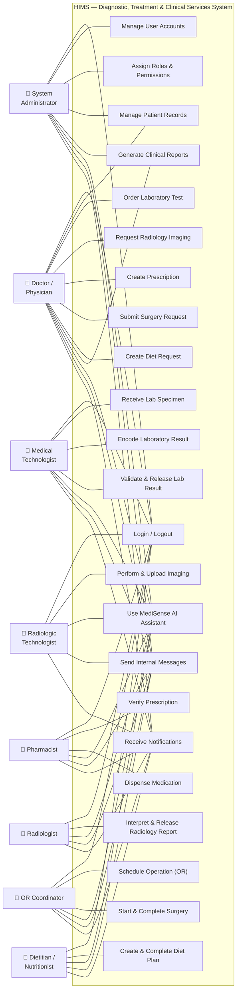

**Diagram Description:** The Use Case Diagram represents all 23 implemented system use cases mapped to the 8 actual user roles. Every role can log in, use MediSense AI, send messages, and receive notifications. Doctors have the broadest access — initiating clinical requests across all five modules. Specialist roles (Medical Technologist, Pharmacist, etc.) have module-specific use cases. The System Administrator manages user accounts and role assignments.

---

## Figure 13. Sequence Diagram

> **Status: IMPLEMENTED** — Laboratory Test Request and Result Workflow (the most complete end-to-end clinical workflow in the system, verified against [LabRequestController.php](file:///c:/Users/Jhonl/OneDrive/Desktop/DITC/app/Http/Controllers/Lab/LabRequestController.php) and `LabResultController.php`).

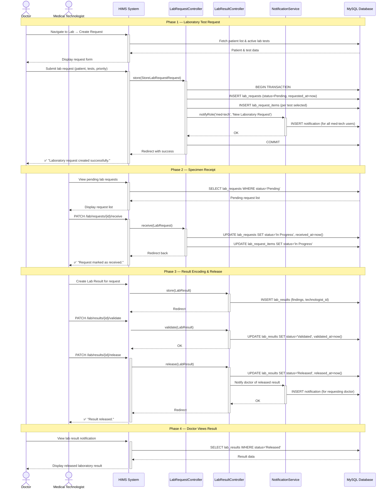

**Diagram Description:** The sequence diagram traces the complete Laboratory Test Request and Result lifecycle — the most fully implemented cross-role workflow in the HIMS. It spans four phases: request creation (Doctor), specimen receipt (Medical Technologist), result encoding/validation/release (Medical Technologist), and result retrieval (Doctor). The `NotificationService` broadcasts real-time in-system alerts at key workflow transitions, verified against the actual controller implementation.

---

## Figure 14. System Flowchart

> **Status: IMPLEMENTED** — End-to-end system authentication and clinical module access flowchart based on actual Laravel Breeze + RBAC middleware implementation.

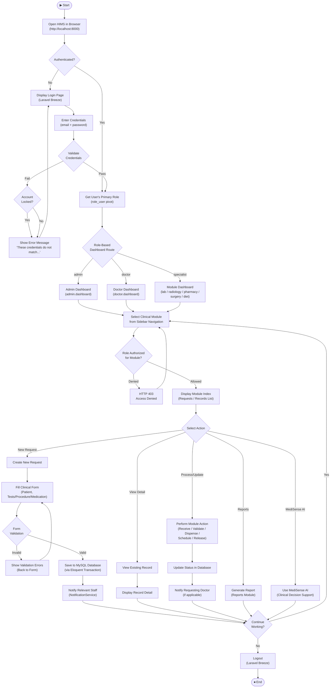

**Diagram Description:** The system flowchart illustrates the complete end-to-end user journey through the HIMS — from browser access through authentication, role-based dashboard routing, module selection, RBAC authorization, and clinical action execution, to logout. The flowchart reflects the actual Laravel Breeze authentication mechanism, the role-slug-based dashboard routing, and the five possible clinical actions (create request, view, process/update, generate report, use MediSense AI) available within each module.

---

*End of HIMS Capstone Figures — 14 Diagrams | Based on actual project inspection of `c:\Users\Jhonl\OneDrive\Desktop\DITC`*
